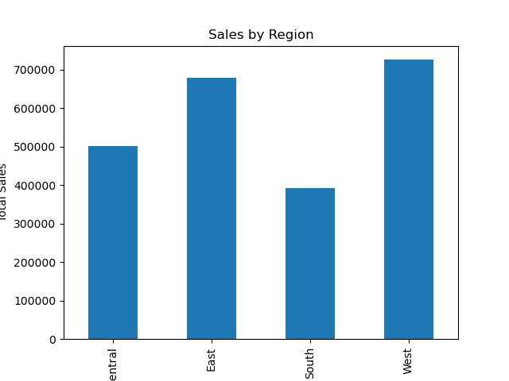
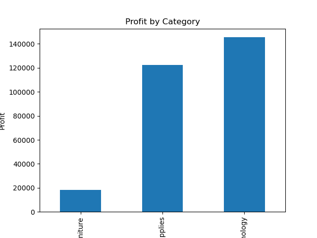
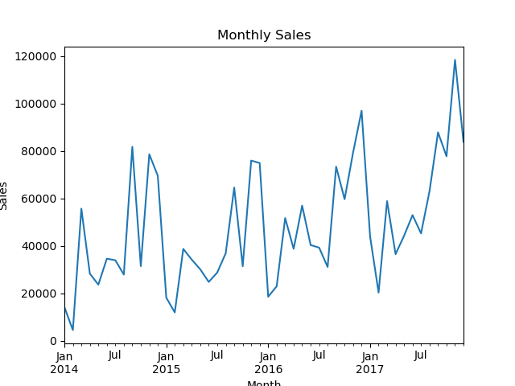
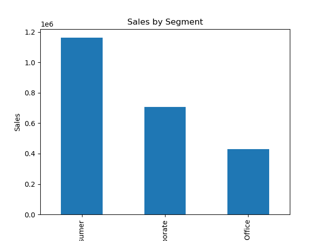

# Sales-data-analysis

# Poject Overview
This project analyzes a retail Superstore dataset to identify sales performance, regional trends, and profitable product categories. The goal is to extract actionable insights that help improve business decidion-making.

# Tools Used
Python
Pandas
Matplotlib
Jupyter Notebook
Power BI(for dashboard)

# Key Questions Answered
- what is the total revenue and profits?
- Which region generates the most sales?
- Which product categories generate the highest profit?
- What are the top selling products?
- What is the monthly sales trend?

# Key Insights
- The West region generates the highest sales.
- Technology category produces the highest profit.
- Sales trends show seasonal varations.

# Project Structure
Data/ - dataset
Notebook/ - analysis notebook
Images/ - visualizations
Dashboard/ - Power BI dashboard

# Dataset
The dataset used in this project is the Superstore retail dataset, which contains information about customer orders including:
• Row ID
• Order ID
• Order Date
• Ship Date
• Ship Mode
• Customer ID
• Customer Name
• Segment
• Country
• City
• State
• Postal Code
• Region
• Product ID
• Category
• Sub-Category
• Product Name
• Sales
• Quantity
• Discount
• Profit

# Project workflow
1. Data Loading
2. Data Cleaning
3. Exploratory Data Analysis
4. Visualization
5. Business Insights

# Visualizations

